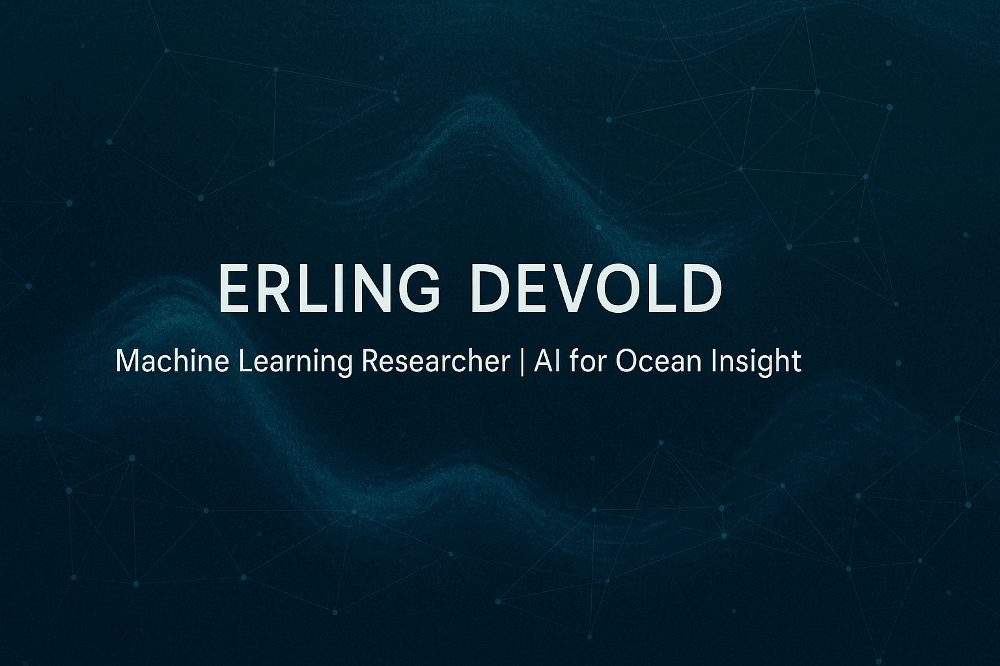

# Hi, I'm Erling Devold 👋

I'm a machine learning researcher and engineer, passionate about building intelligent systems that learn from limited supervision.  
Currently focused on weakly supervised representation learning for sonar data.

---

## 🔧 Tools & Technologies
- 🧠 Python · PyTorch · PyTorch Lightning
- 🔍 Scikit-learn · NumPy · NetCDF4 · OpenCLIP
- 🖼️ DINOv2 · Vision Transformers
- 🧪 Weights & Biases · Hydra
- 🌊 EK80 · Broadband echosounders · Catch reports
- ⚛️ React · TailwindCSS 

---

## 📌 Projects
- 🎹 **ChordPilot** *(coming soon)*  
  A creative AI assistant for chord progression development, blending music theory with generative modeling.

- 🌍 **Marine Imaging + AI**  
  Applied research in sonar, object detection, and citizen science for jellyfish monitoring.

---

## 🌱 Currently
- Preparing two papers: one for **ICESJMS**, one for **ECCV 2026**
- Experimenting with **DINOv2 attention** for self-explainable classifications.
- Building early-stage content around AI + music learning

---

## 🧭 Background
- 🎓 MSc in Computer Science – Machine Learning specialization
- 🔬 Research at SINTEF
- 🐚 Exploring the edge between ocean tech, ML, and creativity

---

## 📫 Get in Touch

- [LinkedIn](https://linkedin.com/in/erlingdevold)  
- [Website](https://erlingdevold.github.io)  
- `erling.devold@icloud.com`
